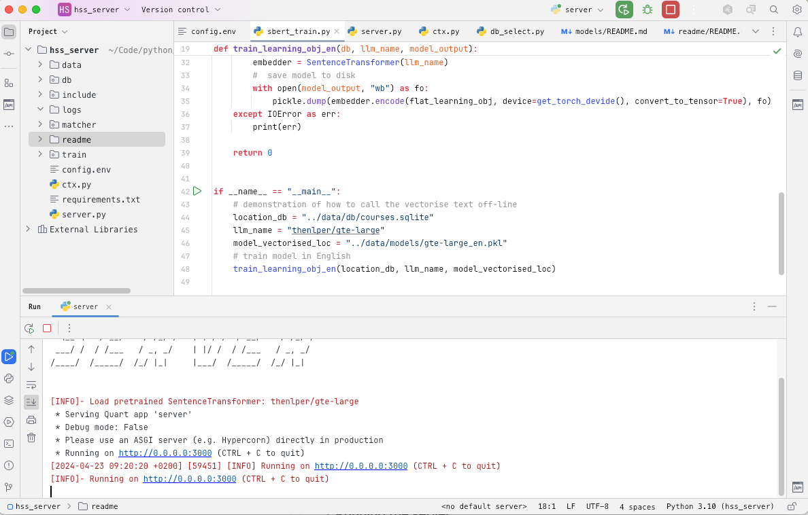
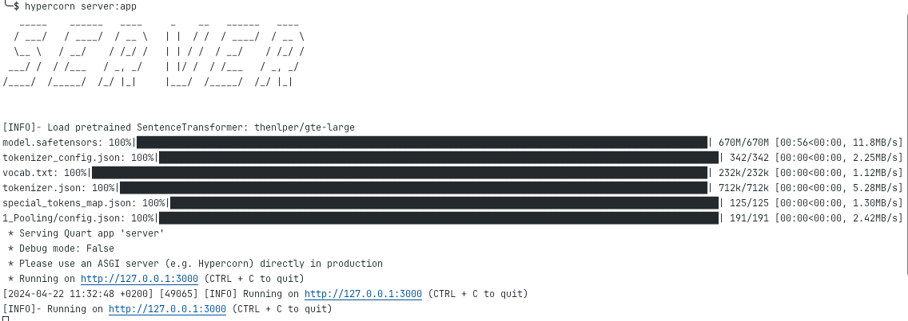
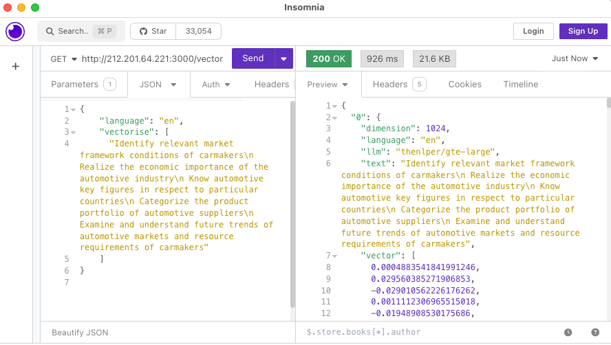

# Server Installation Instructions

These steps show how to install and deploy the server, including all pre-requirement and libraries.

Notice that this instructions are for linux.

## Installing

To deploy the server for the first time all dependencies should be installed, the following instructions show one way of installing the software under linux. Notice that this is not the only way and in other operating systems such as Windows the process may be different.

- Install python 3.10

    ```console
      $ sudo apt install python3.10-venv
    ```

- Install pip package manager

  ```console
    $ sudo apt-get update
    $ sudo apt install python3-pip
  ```

- Create virtual environment

  ```console
    $ pip install virtualenv
  ```

- Activate python environment

  ```console
    $ source .venv/bin/activate
  ```  

- Deactivate python environment

  ```console
    $ deactivate
  ```

- Download and copy the server files to your local project folder

- Install dependencies (i.e. requirements)

  ```console
    $ pip3 install -r requirements.txt
  ```

- In some cases it may be necessary to install some dependencies manually, such as:
  - sentence-transformers. [https://sbert.net/](https://sbert.net/)
  - torch. [https://pytorch.org/get-started/locally/](https://pytorch.org/get-started/locally/)
  
  if this is the case, you need to go directly to the libraries source and follow the instructions to install the software in you local system.

## Running the server

- The application can be run with an IDE (as shown in the image), or within a  console with the following command:

  ```console
    $ python3 server.py
  ```

  or

  ```console
    $ hypercorn server:app
  ```

  

- The first time that the server is run the chosen LLM model will be downloaded

  

## Testing the server

To test the server you can use an IDE or a command line, as per the following examples:

- Requesting a text vectorisation using an IDE

  

- Requesting a text vectorisation with command line curl command

```json
    $ curl --request GET \
  --url 'http://212.201.64.221:3000/vectorise/?=' \
  --header 'Content-Type: application/json' \
  --data '{
    "language": "en",
    "vectorise": [
			"Identify relevant market framework conditions of carmakers\n Realize the economic importance of the automotive industry\n Know automotive key figures in respect to particular countries\n Categorize the product portfolio of automotive suppliers\n Examine and understand future trends of automotive markets and resource requirements of carmakers" 
    ]
}
'
  ```

## Notes

- create requiements file
  - $ pip3 install pipreqs
  - $ pip3 freeze > requirements.txt
  - $ pip3 install -r requiements.txt

- main dependencies
  - docx==0.2.4
  - docx2python==2.10.1
  - Levenshtein~=0.25.1
  - pandas~=2.2.2
  - pyfiglet~=1.0.2
  - python-dotenv==1.0.1
  - numpy==1.24.3
  - sentence-transformers==2.7.0
  - torch==2.2.2
  - torchvision==0.17.2
  - quart-cors==0.7.0
  - quart==0.19.5
